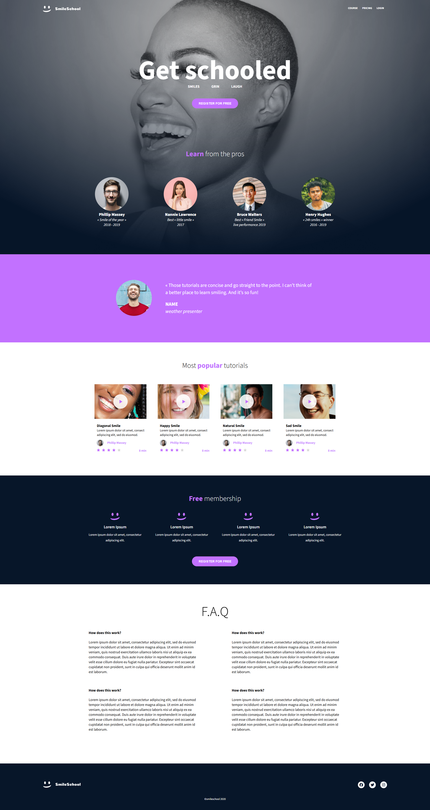

# SmileSchool – CSS Advanced Project

This project is part of the ALX Software Engineering Program. It demonstrates advanced HTML and CSS skills by recreating a responsive, visually accurate landing page based on a Figma design.

## 📸 Preview



## 🖥️ Project Description

The goal of this project is to replicate the **SmileSchool** one-page website using only HTML and CSS (no JavaScript or external libraries). The final result adheres closely to the original design, ensuring pixel-perfect layout and styling.

The web page includes the following sections:

- ✅ Header & Banner (Hero section with logo and CTA)
- 💬 Quotes (Testimonials from learners)
- 🎥 Video List (Popular tutorials)
- 🎓 Membership (Features of free membership)
- ❓ FAQ (Frequently Asked Questions)
- 🔗 Footer (With logo and social links)

All code is semantic, responsive, and accessible.

## 🧠 Learning Objectives

By completing this project, I am able to:

- Explain what CSS is and how it styles web content
- Apply styles via inline, internal, and external CSS
- Use classes, IDs, and various CSS selectors appropriately
- Calculate and compare CSS specificity
- Understand and apply the CSS box model (margin, padding, border, content)
- Explain how browsers render and style HTML documents

## 📁 Project Structure

```plaintext
css_advanced/
├── index.html       # Main HTML file (provided with edits)
├── styles.css       # External stylesheet with all styles
├── images/          # Project assets (logos, backgrounds, avatars, etc.)
└── README.md        # Project overview and documentation
```

## 🛠️ Technologies Used

- **HTML5**
- **CSS3** (Flexbox, Grid, Media Queries)
- **Semantic HTML**
- **Figma** (for visual reference and spacing)
- **W3C Validator** for code validation

## 📸 Design Compliance

All layout, spacing, colors, and fonts closely follow the Figma design.  
Some float values were rounded for simplicity, and fallback fonts were used where unavailable.

## 📚 Resources Used

- 🎨 **Figma Design**: [Homepage Design on Figma](https://www.figma.com/file/dyYL6Ku4WG7vsdpwvlcJZC/Homepage)  
  Used as the visual reference for layout, spacing, colors, and typography.

- 🖼️ **Assets & Images**: [Download Assets](https://savanna.alxafrica.com/rltoken/sGbjBBQFlXg61KqQaWzurA)  
  Includes logos, icons, and other images needed to build the page.

## 🚫 Constraints

- ❌ No external libraries (e.g., Bootstrap, Tailwind, jQuery)
- ❌ No JavaScript
- ❌ No build tools (Webpack, Sass, etc.)

## ✅ Requirements Met

- ✅ W3C-compliant code
- ✅ Clean, organized, and maintainable CSS
- ✅ Responsive design using Flexbox and Grid
- ✅ Accurate match with the Figma prototype

## 👨‍💻 Author

Created by **Abderrahmane Abdelouafi**  
ALX Software Engineering Program – CSS Advanced Project
