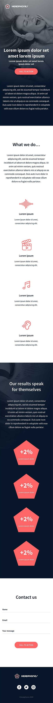

# 🎧 Headphones - ALX Implement a design from scratch Assignment

## 📌 Project Overview

This project involves building a responsive and accessible landing page for a product (headphones), progressively enhancing it from basic HTML and CSS to include advanced styling and interactive elements like a responsive navigation menu.

The goal is to recreate a professional web design provided via **Figma**, following a pixel-perfect approach, while ensuring proper structure, responsiveness, and accessibility across various stages of development.

## 🎯 Objectives

* Replicate the provided Figma design with high visual accuracy.
* Write clean, semantic HTML markup.
* Style the page using modern CSS practices (Flexbox, Grid, media queries).
* Implement interactive elements using vanilla JavaScript.
* Ensure responsiveness across all screen sizes, including mobile and tablet.
* Maintain strong accessibility features for all users.

## 🧰 Technologies Used

* HTML5
* CSS3 (Flexbox, Grid, Media Queries, CSS Variables, Animations)
* JavaScript (Vanilla JS for interactive elements)
* Figma (design reference)
* Custom Icon Font (holberton_school-icon)
* Fonts:
  * [Source Sans Pro](https://fonts.google.com/specimen/Source+Sans+Pro)
  * [Spin-Cycle-OT](https://fonts.adobe.com/fonts/spin-cycle-ot)

## 📐 Key Features & Design Rules

* ✅ **Responsive Layout:** Adapts seamlessly to different screen sizes. The mobile version is triggered when screen width $\leq$ 480px.
* ✅ **Max Width:** Main content sections do not exceed 1000px and are horizontally centered.
* ✅ **Interactive Hamburger Menu:** A mobile-friendly navigation menu that transforms into a close icon using CSS transitions and JavaScript.
* ✅ **Link Hover/Active Color:** `#FF6565`
* ✅ **Button Hover/Active:** `opacity: 0.9`
* ✅ **Accessibility:** Semantic HTML elements, descriptive `alt` text for images, and focus styles for keyboard users.
* ✅ **CSS Animations:** Subtle animations on various elements for enhanced user experience (e.g., hover effects on feature/result items).

## 🗂️ Project Structure

The project is structured in progressive stages, with each `X-index.html` and `X-styles.css` file representing a specific development step. `8-script.js` contains the JavaScript for the final iteration.

```plaintext
headphones/
├── 0-index.html
├── 0-styles.css
├── 1-index.html
├── 1-styles.css
├── 2-index.html
├── 2-styles.css
├── 3-index.html
├── 3-styles.css
├── 4-index.html
├── 4-styles.css
├── 6-index.html
├── 6-styles.css
├── 7-index.html
├── 7-styles.css
├── 8-index.html          # Final HTML structure with JavaScript integration
├── 8-styles.css          # Final CSS styling (including responsive rules)
├── 8-script.js           # JavaScript for interactive elements (e.g., hamburger menu)
├── fonts/                # Custom and imported font files
├── holberton_school-icon/# Custom icon font files and related assets
├── images/               # All image assets from the Figma design
├── preview/              # Screenshots for preview (desktop, tablet, mobile)
└── README.md             # Project documentation (this file)
```

## 📱 Responsive Layout

This project is fully responsive and adapts seamlessly to different screen sizes using CSS media queries.

- **Desktop:** Default full layout for screens wider than 1000px.
- **Tablet:** Adjusted spacing and scaling.
- **Mobile:** Simplified layout for screens 480px wide or less.

## 🧑‍💻 How to Use

1. Clone the repository:
```bash
   git clone https://github.com/edunwant42/alx_html_css.git
```
2. Navigate to the headphones directory:
```bash
   cd headphones
```
3. Open the desired `X-index.html` file in your web browser. For the complete, interactive version, open `8-index.html`.

## 🖼️ Preview

Here’s a glimpse of how the project looks across different devices:

### 💻 Desktop View
<p align="center">
  
</p>

### 📱 Tablet View
<p align="center">
  
</p>

### 📱 Mobile View
<p align="center">
  
</p>

## 🙌 Acknowledgements

- 🎨 Design by: Nicolas Philippot (UI/UX Designer)

- 🔤 Fonts used: Source Sans Pro, Spin-Cycle-OT

- 🖼️ Design source: Provided via Figma by ALX team
